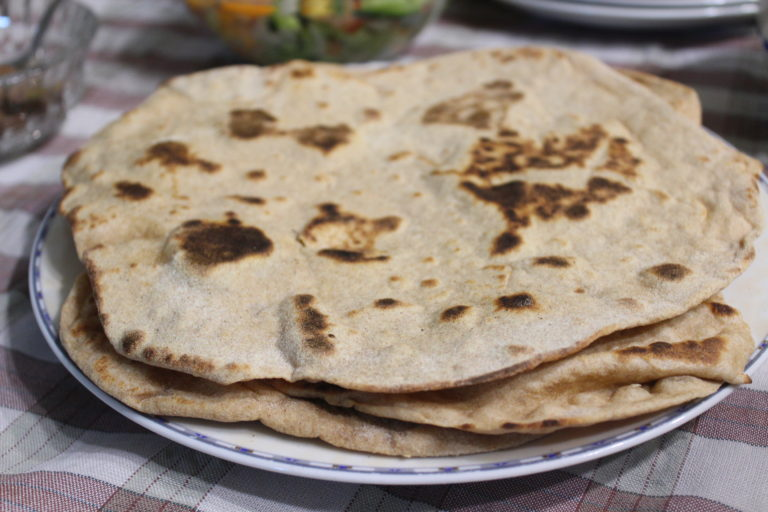

### Leírás

A [laffa](https://en.wikipedia.org/wiki/Laffa) egy közel-keleti száraz serpenyőben megsütött kovászos lepény, melyet apróra vágott sült hússal, zöldségekkel, vagy éppen sajttal tölthetünk meg egy kiadós vacsorához.

### Hozzávalók

- 600g liszt
- 1 csomag élesztő (7g instant élesztő)
- 200ml langyos víz
- 2 kk cukor
- 3 kk só
- 100ml olaj

### Instrukciók

1. Az élesztőt a vízbe morzsoljuk, hozzáadjuk a cukrot és néhány percre félretesszük.

2. A lisztet tálba szitáljuk, belekeverjük a sót és az olajat.

3. Az élesztős langyos vizet a tálba öntjük.

4. Rugalmas tésztát gyúrunk, majd néhány percig dagasztjuk.

5. Kiolajozott tálban, egy **tiszta** konyharuhával letakarva fél órán át pihentetjük.

6. Ökölnyi méretű gömböket formázunk a tésztából.

7. Újból pihentetjük 20 percig letakarva a gömböket.

8. Felforrósítjuk a serpenyőt.

9. A gömböket egy lisztezett gyúródeszkán kinyújtjuk.

10. A forrá serpenyőben előbb az egyik, majd a másik oldalát megsütjük. **(Figyeljünk oda, mert hamar megég, egy-egy perc elegendő mindkét oldalnak ahhoz, hogy átsüljön a laffa)**

11. A megsütött laffákat egy tányéron **nedves** konyharuhával letakarva felhalmozva tároljuk.

